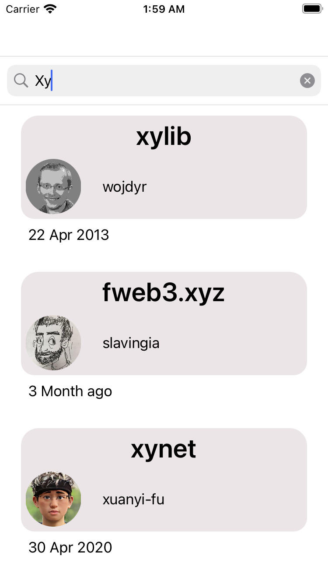
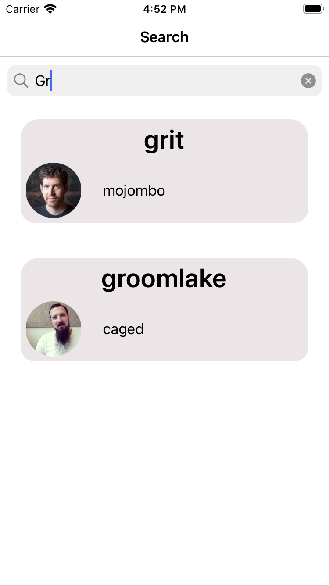
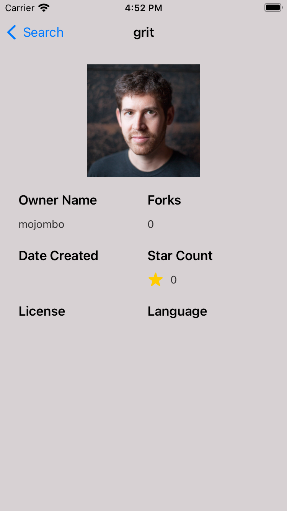

# Git hub search app

search by name to get Repositories and details of Repository
 

 

   

## Consist Of
- Home Repositories Screen
- Repository details screen

    
## Tech Stack
- UIKit
- Architectural pattern (MVP-C)
- Clean Architecture
- Design Patterns (Coordinator - Repository - Builder)
- Unit Testing
    

## Requirements
- iOS 15.
- Xcode 13.0 or later.

    
## Authors

- [Mohamed Abdalla](https://www.linkedin.com/in/mohamed-abdallah-9a97b3b5/)

